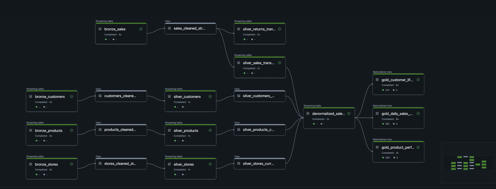

# Databricks DLT Apparel Pipeline: A Learning Project

> This project is an independent educational resource and is not endorsed by Databricks, Inc. "Databricks" is a registered trademark of Databricks, Inc.

## Note to testers!

Thanks for your interest in testing out my Databricks DLT Apparel Pipeline project! I'm excited to hear what you think.

You can get started by importing the repo into a free Databricks account. The <a href="ProjectPlan.md">ProjectPlan.md</a> file walks you through everything.

My main goal is to make this as useful as possible for learners. As you go, could you let me know:

1. Were the instructions in ProjectPlan.md easy to follow? (e.g., did anything leave you stuck or confused?)
2. Would a video guide be helpful? (Or do you prefer the challenge of the written instructions, which encourages looking things up in the docs?)

There's no pressure, but any feedback you could provide on these points would be incredibly valuable. If you'd like, I'll tag your GitHub username as a contributor to this project.

Let me know if you run into any issues!

If you have any questions, feedback, or run into any problems, feel free to reach out by emailing me at hi@dataengineer.wiki or by starting a discussion on the GitHub repository.

## 1. Context and Goal

Welcome to the Apparel Retail 360 project! In today's data-driven world, retail companies rely on timely and accurate data to understand customer behavior, manage inventory, and optimize sales strategies. The goal of this project is to build a robust, multi-layered data processing pipeline that simulates this real-world challenge.

You will take on the role of a Data Engineer tasked with building an end-to-end analytics platform. Using Delta Live Tables, you will ingest raw data, progressively clean and transform it through a medallion architecture (Bronze, Silver, and Gold layers), and ultimately produce curated datasets ready for business intelligence and reporting.

Feel free to reach out to me if you have any questions. My contact details are available on dataengineer.wiki.

## 2. By completing this project, you will gain hands-on experience with:

- Ingesting and processing continuous data streams.
- Applying and managing data quality expectations.
- Implementing a medallion architecture in DLT.
- Handling historical data changes using Slowly Changing Dimensions (SCD Type 2).
- Creating business-ready, aggregated tables for analytics.

## 3. Architecture

- Databricks Free Edition
- Synthetic streaming data (generated by data_generator.py)
  - It imitates real world data
  - It generates 4 tables (a fact sales table, and 3 lookup tables - stores, customers, products)
- DLT pipeline
  - You'll create a DLT pipeline to ingest, clean and aggregate raw data.
  - At the end, your pipeline will look like this
    

## 4. How to start?

Read <a href="ProjectPlan.md">ProjectPlan.md</a>

---

## Appendix: How This Project Prepares You for the Databricks Data Engineer Associate Certification

This hands-on project is designed to closely mirror the real-world skills and knowledge areas assessed in the Databricks Certified Data Engineer Associate exam. By completing this project, you will gain practical experience with the Databricks Data Intelligence Platform, Delta Live Tables (DLT), and the medallion architecture, all of which are core to the certification exam. Here’s how the project aligns with the exam outline:

**Section 1: Databricks Intelligence Platform**

- You will work directly in the Databricks workspace, learning to manage data layout, optimize query performance, and select appropriate compute resources for streaming and batch workloads.
- The project demonstrates the value of the Data Intelligence Platform by showing how it simplifies ETL, governance, and analytics.

**Section 2: Development and Ingestion**

- You will use Notebooks and Python scripts to develop and orchestrate data pipelines, similar to real Databricks workflows.
- The project’s raw data ingestion leverages Delta Lake and streaming, exposing you to Auto Loader-like patterns and troubleshooting data ingestion issues.

**Section 3: Data Processing & Transformations**

- The pipeline implements the three layers of the Medallion Architecture (Bronze, Silver, Gold), giving you hands-on experience with their purposes and best practices.
- You will use DLT to build ETL pipelines, apply data quality expectations, and perform complex aggregations with PySpark DataFrames.
- The project covers DDL/DML operations and demonstrates how to manage schema evolution and data transformations.

**Section 4: Productionizing Data Pipelines**

- You will learn about deploying and orchestrating pipelines, handling failures, and rerunning tasks, which are key for production workflows.
- The project encourages you to analyze Spark UI and optimize queries for performance.
- You will see the difference between serverless and cluster-based compute, and understand Databricks Asset Bundles (DAB) concepts through pipeline configuration.

**Section 5: Data Governance & Quality**

- The project uses Unity Catalog concepts (catalogs, schemas, volumes) and demonstrates the difference between managed and external tables.
- You will practice setting up permissions, understanding roles, and using data lineage features.
- The pipeline’s data quality checks and expectations prepare you for questions on governance, audit logging, and Delta Sharing.

**Recommended Preparation**

- This project complements Databricks Academy’s self-paced and instructor-led courses, providing the hands-on experience recommended for the exam.
- By following the project plan and checklist, you will cover all major exam topics, from ingestion to governance.

**Exam Details**

- 45 multiple-choice questions, 90 minutes, online proctored.
- No prerequisites, but hands-on experience (like this project) is highly recommended.
- For the latest exam guide and recommended training, visit the official Databricks certification page.
